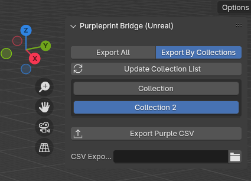

# 🟣 Purpleprint Bridge

**Purpleprint Bridge** is a Blender add-on designed to export scene object data into a format compatible with [Purpleprint Placer](https://github.com/Hevedy/Purpleprint-Core) and other Unreal Engine-based tools.

This tool enables quick and structured transfer of level design data from Blender to Unreal Engine pipelines, making it ideal for prototyping, layout planning, and mass placement of entities in-game.  

  

---

## ✨ Features

- ✅ Exports only objects marked as **visible for render**.
- 🚫 Ignores `Empty` objects, but **applies their world transforms to their children**.
- 🧠 Smart grouping: all instances of the same model use the same `Type` name.
- 🌐 Exports **world-space** transforms: `Location`, `Rotation` (in degrees), and `Scale`.
- 🔁 Recursively processes object hierarchies.
- 📄 Output is compatible with Unreal Engine tools, such as **Purpleprint Placer**.

---

## 📄 CSV Format

The exported `.csv` file follows Unreal-style formatting:
  ```csv
  Row,"Name","Type","(X=0,Y=0,Z=0)","(Pitch=0,Yaw=0,Roll=0)","(X=1,Y=1,Z=1)"
  ```

---

## Links
[Purpleprint](https://www.hevedy.com/purpleprint/)
[Purpleprint Core](https://github.com/Hevedy/Purpleprint-Core)

---

### 🔍 Field Breakdown:
- **Name**: Blender object name.
- **Type**: Object type and its mesh/model name.
- **Location**: Global position formatted as Unreal vector.
- **Rotation**: Global rotation in Unreal's `(Pitch, Yaw, Roll)` format.
- **Scale**: Global object scale.

---

## 🗂 Default Export Path

By default, the `.csv` file is saved to:

```<your_blendfile_directory>/purpleprint_entities.csv```

You can choose a custom path in the panel, and it will be saved with your `.blend` project for future use.

---

## 🧭 Installation

1. Download `PurpleprintBridge.py`.
2. Open Blender and go to `Edit > Preferences > Add-ons`.
3. Click **Install**, select the Python file, and enable the addon.
4. Find the **Export Tools** panel in the **3D Viewport Sidebar** (`N` key).
5. Click **"Export Purple CSV"** to generate your `.csv` file.

---

## 🛠 Use Case

Purpleprint Bridge is perfect for:

- Level designers using Blender as a blocking/layout tool.
- Technical artists building automated import systems in Unreal.
- Anyone needing to export world-space transform data from Blender into readable `.csv` formats for runtime placement or instancing in Unreal.

---

## ✅ Compatibility

- Blender **4.0** and above
- Compatible with Unreal Engine 4 & 5
- Output ready for tools like [**Purpleprint Core**](https://github.com/Hevedy/Purpleprint-Core) & [**Purpleprint Placer**](https://www.hevedy.com/purpleprint/)

---

## 📜 License

This project is licensed under the **GNU General Public License v3.0**.

You are free to use, modify, and redistribute this code under the terms of the GPL.

See the full license text in the [`LICENSE`](./LICENSE) file or visit:  
👉 https://www.gnu.org/licenses/gpl-3.0.html

---

## 🙏 Credits

Made with ❤️ by [Hevedy](https://github.com/Hevedy/) using Blender's `bpy` API.  
If you find this tool useful or want to contribute, feel free to fork, star, or open issues!